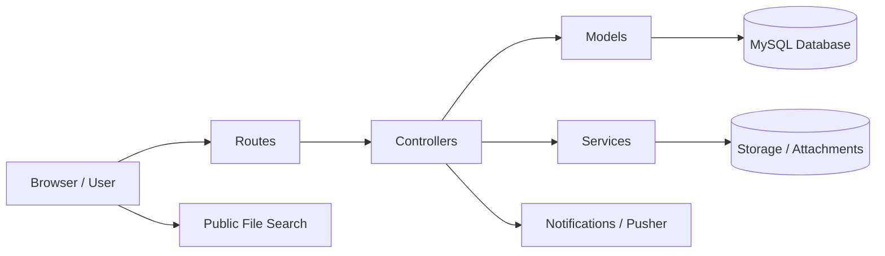

# FileTrack Office Portal

FileTrack Office Portal is a Laravel 12 web application for managing government departmental files from creation to transfer, tracking, and public lookup. It supports role-based access, department ownership, file movement history, notifications, and impersonation for administrative workflows.

## Overview

This system is designed for office environments where files must be:
- created and assigned to a department,
- transferred quickly between departments or users,
- tracked through a visible movement history, and
- reviewed by administrators with clear role-based permissions.

## Key Features

- File creation with manual, unique file numbers and optional attachments
- Immediate file transfer between departments or users
- Department-scoped dashboards for admins and super admins
- Linked timeline view for every file movement
- Public file search without authentication
- Real-time notifications for new file activity
- Impersonation support for support/admin workflows
- Forced password change on first login for newly created accounts

## Roles

| Role | Purpose |
|---|---|
| Super Admin | Oversees the full system, manages departments/users, and views system-wide dashboards |
| Admin | Manages users within a department and monitors department file activity |
| User | Creates and transfers files within allowed workflows |

## Technology Stack

- PHP 8.2+
- Laravel 12
- MySQL 8+
- Blade + Tailwind CSS + Vite
- Pusher for notifications
- Pest for automated testing

## System Architecture

The application follows a layered Laravel architecture:



### Main components

- Presentation layer: Blade views, Tailwind UI, and Vite-built assets
- Application layer: Controllers, middleware, and service classes for dashboards, transfers, and notifications
- Data layer: MySQL tables for users, departments, files, movements, transfers, and audit data
- Integration layer: Pusher-based notifications and file storage
- Public access layer: unauthenticated search endpoint for file lookup

## Project Structure

- app/Http/Controllers: request handling for files, transfers, dashboards, notifications, and auth-related features
- app/Models: file, user, department, transfer, movement, and notification models
- app/Services: dashboard aggregation and reusable business logic
- resources/views: Blade templates for dashboards, file views, and admin panels
- routes/web.php: application routing, role-based middleware, and public endpoints
- database/migrations: schema definitions for users, files, departments, movements, and transfers

## Requirements

- PHP 8.2 or newer
- Composer
- Node.js and npm
- MySQL 8+
- Git

## Local Setup

1. Clone the repository

```bash
git clone <repository-url>
cd file-tracking-system
```

2. Install PHP dependencies

```bash
composer install
```

3. Install frontend dependencies

```bash
npm install
```

4. Create the environment file

```bash
copy .env.example .env
```

On Linux or macOS:

```bash
cp .env.example .env
```

5. Configure the database in the .env file

```env
DB_CONNECTION=mysql
DB_HOST=127.0.0.1
DB_PORT=3306
DB_DATABASE=file_tracking_system
DB_USERNAME=root
DB_PASSWORD=
```

6. Generate the application key

```bash
php artisan key:generate
```

7. Run database migrations

```bash
php artisan migrate
```

8. Create the storage link

```bash
php artisan storage:link
```

9. Start the application

```bash
composer run dev
```

The app will be available at http://127.0.0.1:8000.

## Running Tests

```bash
php artisan test
```

## Notes

- The system uses manual file numbering and enforces uniqueness across files.
- Public file search is intentionally limited to metadata and current holder information.
- The file timeline is a core part of the product and shows the full movement history for every record.
| Too many redirects | Clear browser cookies + `php artisan optimize:clear` |

---

## Update From Upstream

```bash
git remote add upstream https://github.com/ORIGINAL_OWNER/file-tracking-system.git
git fetch upstream
git merge upstream/main
```

---

## Tech Stack

- **Backend:** Laravel 12, PHP 8.2
- **Frontend:** Bootstrap 5.3, Font Awesome 6.5, Inter font
- **Database:** MySQL 8
- **Storage:** Laravel private disk (file attachments), public disk (profile photos)
- **Notifications:** Laravel database notifications with polling

---

&copy; FileTrack Office Portal — Government File Tracking System
